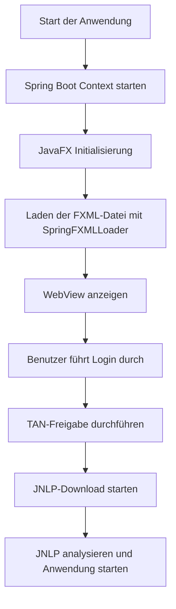

# Comdirect JNLP Automatisierung

## Projektbeschreibung

Dieses Projekt ist eine JavaFX-Anwendung, die den Login- und Freigabeprozess der Comdirect-Website automatisiert. Es kombiniert **Spring Boot** und **JavaFX**, um eine moderne Benutzeroberfläche und eine erweiterbare Backend-Integration zu bieten. Der Benutzer kann sich einloggen, die TAN-Freigabe durchführen und eine JNLP-Datei verarbeiten lassen.

## Anforderungen

### Softwarevoraussetzungen

- **Java 21 oder höher** (kompatibel mit JavaFX 21)
- **Gradle 7.5 oder höher**
- **IDE** (z. B. IntelliJ IDEA oder Eclipse)
- Internetverbindung

### Abhängigkeiten
Die wichtigsten Abhängigkeiten sind:

- **Spring Boot 3.1.4**: Für Dependency Injection und erweiterbare Konfiguration
- **JavaFX**: Für die Benutzeroberfläche und WebView-Komponente
- **Playwright**: Für die Interaktion mit der Webseite
- **Jsoup**: Für das Parsen der heruntergeladenen JNLP-Dateien

Alle Abhängigkeiten sind in der Datei `build.gradle` definiert.

## Einrichtung

1. **Projekt klonen**:
   ```bash
   git clone https://github.com/username/comdirect-jnlp.git
   cd comdirect-jnlp
   ```

2. **Abhängigkeiten installieren**:
   Stelle sicher, dass alle Abhängigkeiten korrekt geladen werden:
   ```bash
   ./gradlew build
   ```

3. **Anwendung starten**:
   ```bash
   ./gradlew run
   ```

4. **Anwendung als ausführbare JAR starten**:
   Die JavaFx Libraries (nicht die JARs) müssen gesondert gedownloaded, entpackt und eingebunden werden:
   ```bash
   "C:\Program Files\Zulu\zulu-21\bin\java" --module-path "C:\javafx-sdk-21.0.5\lib" --add-modules javafx.controls,javafx.fxml,javafx.web -jar comdirect.jar
   ```

   Ersetze `/path/to/java-21/` mit dem Verzeichnis, in dem sich dein Java 21 befindet.

## Projektstruktur

```
comdirect-jnlp
├── src
│   ├── main
│   │   ├── java
│   │   │   └── comdirect
│   │   │       ├── Main.java             // Hauptklasse zur Integration von JavaFX und Spring Boot
│   │   │       ├── BrowserUtils.java     // Hilfsfunktionen für die WebView
│   │   │       ├── controllers
│   │   │       │   └── MainController.java // Logik des Hauptfensters
│   │   │       └── services
│   │   │           └── BrowseService.java // Service zur Webseiten-Navigation
│   │   └── resources
│   │       ├── views
│   │       │   └── main.fxml              // FXML-Datei für die Benutzeroberfläche
│   │       └── application.properties     // Spring-Konfiguration
├── build.gradle                           // Gradle-Builddatei
└── README.md                              // Dokumentation
```

## Workflow der Anwendung



## Debugging

1. **Fehlermeldungen prüfen:**
   Wenn die Anwendung nicht startet, überprüfe die Konsole auf Fehler wie fehlende Ressourcen oder Initialisierungsprobleme.

2. **FXML-Dateien testen:**
   Stelle sicher, dass die Pfade zu den FXML-Dateien korrekt sind. Die Datei `main.fxml` sollte sich im Ordner `src/main/resources/views` befinden.

3. **WebView-Inhalte prüfen:**
   Falls die Comdirect-Seite eine Fehlermeldung anzeigt (z. B. "Funktionsstörung"), stelle sicher, dass die URL korrekt ist und die Internetverbindung stabil ist.

## Nächste Schritte

- **Fehlerhandling verbessern:**
  Implementiere spezifische Fehlermeldungen für Szenarien wie fehlende JNLP-Dateien oder Verbindungsprobleme.

- **Automatisierung erweitern:**
  Füge eine Funktion hinzu, um die TAN automatisch zu erkennen und zu verarbeiten.

- **Tests hinzufügen:**
  Schreibe Unit- und Integrationstests, um die Stabilität der Anwendung zu gewährleisten.

---

## Lizenz

Dieses Projekt steht unter der MIT-Lizenz. Weitere Informationen findest du in der Datei `LICENSE`.

## Autor
Entwickelt von Angelo Iglesias

## Links
- [Making Upcalls from JavaScript to JavaFX](https://docs.oracle.com/javase/8/javafx/embedded-browser-tutorial/js-javafx.htm)
```

